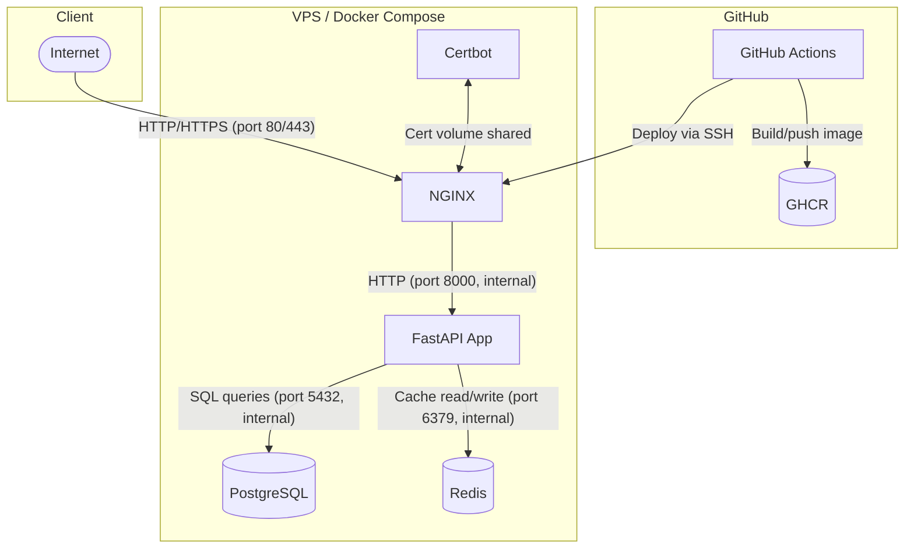

# Architecture

*(Note: The diagram below is also available at [docs/architecture.mmd](architecture.mmd) and can be viewed rendered natively on GitHub.)*



## Project Overview
The FastAPI Task Management API is a production-grade, RESTful web service for managing tasks. It is containerized and deployed on a single Ubuntu VPS using Docker Compose, demonstrating a complete DevOps lifecycle including infrastructure provisioning, CI/CD, observability, and backup strategies.

## Architecture Diagram

```text
                                  Internet
                                     │ (HTTPS / 443)
                                     ▼
                      ┌──────────────────────────────┐
                      │    NGINX (Reverse Proxy)     │
                      │  (TLS Termination via Let's  │
                      │   Encrypt / Certbot)         │
                      └──────────────┬───────────────┘
                                     │
                                     ▼
                      ┌──────────────────────────────┐
                      │       FastAPI App            │
                      │ (Task Management, Rate       │
                      │  Limiting Middleware)        │
                      └──────┬───────────────┬───────┘
                             │               │
                      ┌──────▼───────┐ ┌─────▼───────┐
                      │  PostgreSQL  │ │    Redis    │
                      │  (Persistent │ │ (Rate Limit │
                      │   Database)  │ │   & Cache)  │
                      └──────────────┘ └─────────────┘
```

## Component Table

| Service | Technology/Image | Purpose | Internal Port | Public Port |
|---|---|---|---|---|
| **NGINX** | `nginx:1.25-alpine` | Reverse proxy, TLS termination, static asset serving, security headers. | 80 | 80, 443 |
| **App** | Custom (`python:3.12-slim`) | Core business logic, rate-limiting, and REST API endpoints. | 8000 | None |
| **PostgreSQL** | `postgres:16-alpine` | Authoritative persistent storage for tasks and user data. | 5432 | None |
| **Redis** | `redis:7-alpine` | Read-through cache for tasks list and rate-limiting counters. | 6379 | None |
| **Certbot** | `certbot/certbot:latest` | Automated Let's Encrypt SSL certificate issuance and renewal. | N/A | None |

## Networking
All services are connected via a user-defined Docker bridge network (`backend_net`).
- **Internal Only**: The `app`, `postgres`, and `redis` containers are completely isolated from the host's public network interface. They do not expose ports to the Internet.
- **Public Facing**: Only `nginx` exposes ports 80 and 443 to the Internet. This ensures that all incoming traffic must pass through the reverse proxy, which enforces TLS and security headers before forwarding traffic to the FastAPI application.

## Data Flow
1. **Client Request**: A user makes an HTTPS request to `https://stack.anshulfml.me/tasks`.
2. **TLS Termination**: NGINX receives the request on port 443, decrypts the TLS payload using the Let's Encrypt certificate, and forwards the plain HTTP request to the internal `app` container on port 8000.
3. **Rate Limiting Middleware**: The FastAPI app intercepts the request, checks the client IP against Redis counters. If the limit is exceeded, it returns a `429 Too Many Requests`.
4. **Cache & Database**: If it's a read request (e.g., `GET /tasks`), the app checks Redis for a cached response. If a cache miss occurs, or if it's a write request, the app queries PostgreSQL. 
5. **Response**: The database returns the data to the app, which caches it in Redis (if applicable), serializes it to JSON, and sends it back through NGINX to the client.

## Design Decisions
- **FastAPI**: Chosen for its high performance (ASGI), automatic OpenAPI documentation, and Python-native type hints.
- **PostgreSQL**: Selected for robust ACID compliance, reliability, and structured relational data management.
- **Redis**: Ideal for high-speed, transient data like API rate limits and short-lived caching, significantly reducing database load.
- **NGINX**: Industry-standard, high-performance reverse proxy. Handles connection management and TLS termination much better than Python web servers like Uvicorn.
- **Docker Compose**: Keeps the single-VPS architecture simple, declarative, and easy to orchestrate without the overhead and complexity of Kubernetes.
